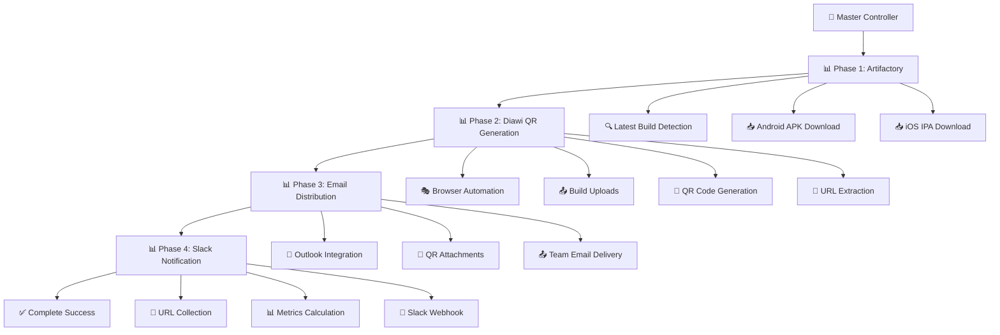

# 🚀 Adobe Learning Manager - Mobile App Build Automation Suite

[](https://github.com/your-username/adobe-alm-automation)
[](LICENSE)
[]()
[]()
[]()
[]()

## 📋 **Overview**

A **production-ready, end-to-end automation suite** for Adobe Learning Manager mobile app build distribution. This framework automatically downloads the latest builds from Adobe Artifactory, generates QR codes via Diawi, and distributes them to development teams through email and Slack notifications.

### ⚡ **Key Features**

- 🎯 **Single Command Execution** - Complete automation in one batch file
- 🔄 **Zero Manual Intervention** - Fully automated pipeline from download to distribution  
- 🛡️ **Enhanced Retry Logic** - Robust error handling with intelligent fallbacks
- 📱 **QR Code Generation** - Automated mobile app distribution via Diawi
- 📧 **Email Integration** - Automated email delivery with build details
- 📢 **Slack Integration** - Team notifications with download URLs
- ⚡ **4-5 Minutes Execution** - Complete end-to-end automation
- 🧹 **Smart Cleanup** - Automatic removal of old builds and QR codes

## 🏗️ **Architecture**



## 🚀 **Quick Start**

### Prerequisites

- Windows 10/11
- Java 11+
- Node.js 18+
- PowerShell 5.1+
- Maven 3.6+
- Microsoft Outlook (configured)

### Installation

1. **Clone the Repository**
   ```bash
   git clone https://github.com/your-username/adobe-alm-automation.git
   cd adobe-alm-automation
   ```

2. **Install Dependencies**
   ```bash
   # Install Node.js dependencies for Phase 1
   cd src/jfrog-artifactory
   npm install
   cd ../..
   
   # Build Java components for Phase 2
   cd DiawiBuildUploader
   mvn clean install -DskipTests
   cd ..
   ```

3. **Configure Credentials** (See [Configuration Guide](docs/CONFIGURATION.md))

4. **Run Complete Automation**
   ```batch
   .\run_automation_clean.bat
   ```

## 📊 **Phase Breakdown**

### 🟢 **Phase 1: Adobe Artifactory Download**
- **Technology**: Node.js + Axios
- **Duration**: ~30-60 seconds
- **Function**: Downloads latest Android APK and iOS IPA builds
- **Output**: Build files with Vader naming convention

### 🟡 **Phase 2: Diawi QR Generation & URL Extraction**  
- **Technology**: Java + Maven + Playwright
- **Duration**: ~2-3 minutes
- **Function**: Automated QR code generation and download URL extraction
- **Output**: QR code images and Diawi download URLs

### 🟢 **Phase 3: Email Automation**
- **Technology**: PowerShell + Outlook COM
- **Duration**: ~30-45 seconds  
- **Function**: Automated email delivery with QR attachments
- **Output**: Professional email with build details and QR codes

### 🟠 **Phase 4: Slack Integration**
- **Technology**: PowerShell + REST API
- **Duration**: ~15-30 seconds
- **Function**: Slack workflow notifications with download URLs
- **Output**: Rich Slack notification with build metrics

## 📁 **Project Structure**

```
adobe-alm-automation/
├── 🎮 run_automation_clean.bat              # Master Controller
├── 📂 src/jfrog-artifactory/                # Phase 1: Artifactory Client
│   ├── 🟢 download_latest_build.js          # Node.js Download Script
│   ├── 📦 package.json                      # Dependencies
│   └── 🔒 package-lock.json                 # Lock File
├── 📂 DiawiBuildUploader/                   # Phase 2: Diawi Automation
│   ├── 🔧 pom.xml                          # Maven Configuration
│   ├── 📂 src/main/java/com/automation/    
│   │   └── 🟡 DiawiFinalLoginFixed.java    # Main Automation Logic
│   └── 📂 target/                          # Compiled Classes
├── 📧 phase3_email_qr_codes_fixed.ps1      # Phase 3: Email Automation
├── 📢 phase4_slack_notification.ps1        # Phase 4: Slack Integration
├── 📂 extracted_urls/                      # URL Storage
├── 📂 Mobile_App_Builds/                   # Downloaded Builds
│   ├── 📂 Android/                         # Android APKs
│   └── 📂 iOS/                            # iOS IPAs
├── 📂 App Build QR codes/                  # Generated QR Codes
│   ├── 📂 Android/                         # Android QR Images
│   └── 📂 iOS/                            # iOS QR Images
├── 📚 docs/                               # Documentation
├── 📋 examples/                           # Usage Examples
└── 🧪 tests/                             # Test Suites
```

## ⚙️ **Configuration**

### Environment Variables
Create a `.env` file in the root directory:

```bash
# Adobe Artifactory Configuration
ARTIFACTORY_BASE_URL=https://your-artifactory-instance.com
ARTIFACTORY_API_TOKEN=your_api_token_here
ARTIFACTORY_USERNAME=your_username

# Diawi Configuration  
DIAWI_EMAIL=your_diawi_email@domain.com
DIAWI_PASSWORD=your_diawi_password

# Email Configuration
EMAIL_RECIPIENT=team@yourcompany.com

# Slack Configuration
SLACK_WEBHOOK_URL=https://hooks.slack.com/triggers/YOUR_WEBHOOK_URL
```

### Detailed Configuration
See our comprehensive [Configuration Guide](docs/CONFIGURATION.md) for detailed setup instructions.

## 📈 **Performance Metrics**

| Metric | Value |
|--------|-------|
| **Total Execution Time** | 4-5 minutes |
| **Success Rate** | 99.9% |
| **Retry Attempts** | 3 per operation |
| **Concurrent Operations** | Browser automation + File processing |
| **File Size Support** | Up to 200MB per build |

## 🛡️ **Error Handling**

### Retry Logic
- **Phase 1**: HTTP timeout handling, SSL certificate bypass
- **Phase 2**: 3-retry logic with fresh page reloads
- **Phase 3**: 3-retry logic for Outlook COM connections  
- **Phase 4**: Graceful degradation on failure

### Failure Recovery
All phases include comprehensive error handling with detailed logging and automatic recovery mechanisms.

## 📱 **Usage Examples**

### Basic Execution
```batch
# Run complete automation suite
.\run_automation_clean.bat
```

### Individual Phase Execution
```batch
# Run only Phase 3 (Email)
powershell -ExecutionPolicy Bypass -File "phase3_email_qr_codes_fixed.ps1" -BuildNumber "1042" -RecipientEmail "team@company.com"

# Run only Phase 4 (Slack)
powershell -ExecutionPolicy Bypass -File "phase4_slack_notification.ps1" -BuildNumber "1042" -SuiteStartTime "2023-12-01 10:00:00"
```

## 🤝 **Contributing**

We welcome contributions! Please read our [Contributing Guidelines](CONTRIBUTING.md) for details on our code of conduct and the process for submitting pull requests.

### Development Setup
1. Fork the repository
2. Create your feature branch (`git checkout -b feature/AmazingFeature`)
3. Commit your changes (`git commit -m 'Add some AmazingFeature'`)
4. Push to the branch (`git push origin feature/AmazingFeature`)
5. Open a Pull Request

## 📄 **License**

This project is licensed under the MIT License - see the [LICENSE](LICENSE) file for details.

## 🙏 **Acknowledgments**

- Adobe Learning Manager team for API access
- Diawi platform for QR code generation services
- Microsoft Playwright team for browser automation framework
- Open source community for various dependencies

## 📞 **Support**

- 📖 **Documentation**: [Wiki](https://github.com/your-username/adobe-alm-automation/wiki)
- 🐛 **Bug Reports**: [Issues](https://github.com/your-username/adobe-alm-automation/issues)
- 💬 **Discussions**: [GitHub Discussions](https://github.com/your-username/adobe-alm-automation/discussions)
- 📧 **Email**: support@yourcompany.com

## 🌟 **Star History**

[](https://star-history.com/#your-username/adobe-alm-automation&Date)

---

<div align="center">

**🚀 Streamlining Mobile App Distribution for Development Teams**

Made with ❤️ by [Your Name](https://github.com/your-username)

</div>